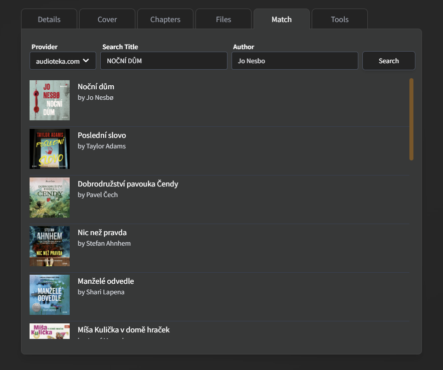
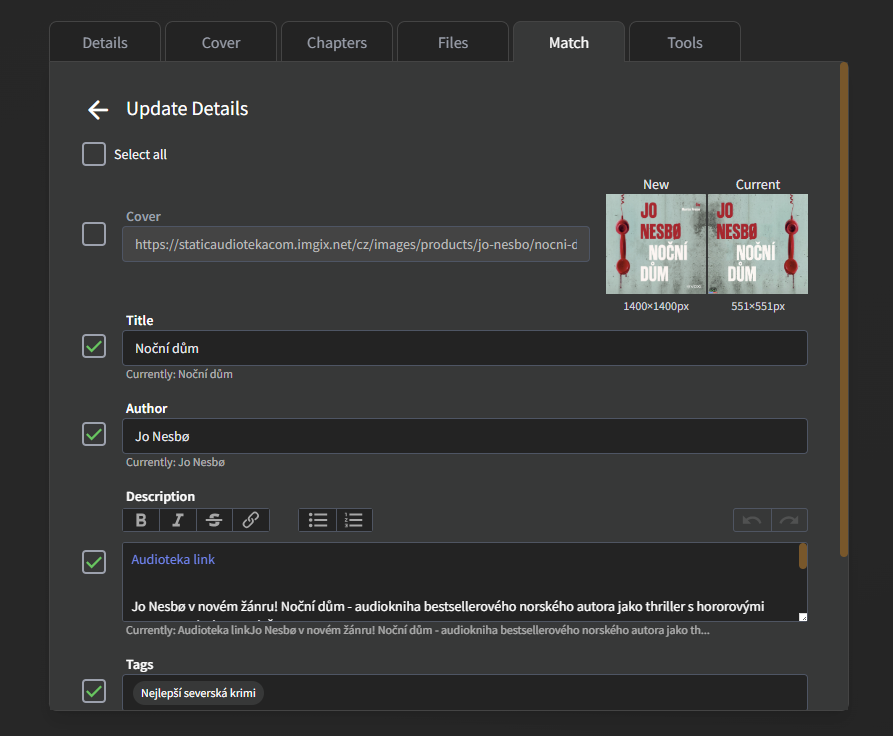
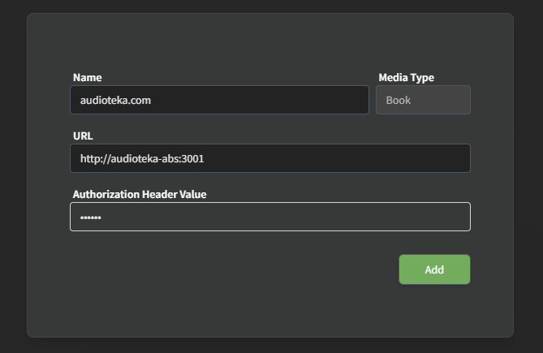

# audioteka-abs

Audiobookshelf custom metadata provider for [audioteka.com](https://audioteka.com/).

At the moment it only supports Czech and Polish sites.

Container registry: https://github.com/cznewt/audioteka-abs/pkgs/container/audioteka-abs

## Screenshots

### List possible matches



### View and select matched data



## Fetching features

- Cover
- Title
- Author
- Publisher
- Series
- Genres
- Language
- Description
- **Narrators**
- **Audiobook cover**

## Instructions to run locally

### Prerequisites

Docker and Docker Compose installed on your system

### Setup and running

1. Create or copy from girhub a compose.yml file in your desired directory with the following content

```
---
services:
  audioteka-abs:
    image: ghcr.io/cznewt/audioteka-abs:main
    environment:
      - LANGUAGE=cz # For Polish users: Change enviorment line to - LANGUAGE=pl
      - ADD_AUDIOTEKA_LINK_TO_DESCRIPTION=false # Optional: Set to 'true' to add the Audioteka link to the description
    ports:
      - "3001:3001"
```

2. Pull the latest Docker images

```
docker-compose pull
```

3. Start the application

```
docker-compose up -d
```

### Updating the Application

To update to the latest version:

```
docker-compose pull
docker-compose up -d
```

### To stop the application

```
docker-compose down
```

### To view logs

```
docker-compose logs -f
```

## How to use in AudiobookShelf

1. Navigate to your AudiobookShelf settings
2. Navigate to Item Metadata Utils
3. Navigate to Custom Metadata Providers
4. Click on Add
5. Name: whatever for example `audioteka.com`
6. URL: http://your-ip:3001
7. Authorization Header Value: whatever, but not blank, for example `00000`
8. Save


